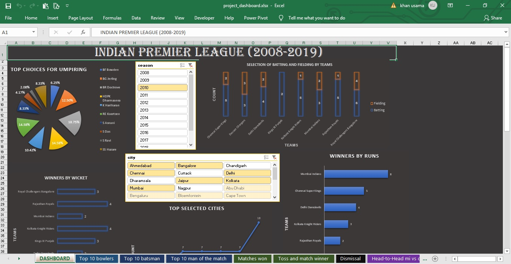

          *click on the project title to view code*

# [Project 1: Parameter Efficient Fine Tuning](https://github.com/usama8199/Parameter-Efficient-Fine-Tuning)
#### Overview
- Understanding the mechanics behind LoRA, QLoRA, and prompt tuning.
- Step-by-step guides on applying these techniques for fine-tuning.
- Evaluating the performance and efficiency of PEFT techniques against traditional fine-tuning approaches. Repository Structure
- Demonstrates prompt tuning on Llama-2-7B for targeted NLP tasks.
-  Showcases the application of QLoRA for fine-tuning on specific datasets.
- A PowerPoint presentation detailing the PEFT concepts, methodologies, and key findings from our experiments.\

# [Project 1: Women Clothing Reviews Prediction](https://github.com/usama8199/Clothing-Review-Prediction-NLP)
#### Overview and Website link
- Cleaned the text data by removing stopwords and lemmatization
- Performed EDA using wordcloud and seaborn to analyse the words effect on reviews
- Performed Layer Embedding on the text data and created a model using LSTM after comparing different model with accuracy of 85%
- Integrate the model on Flask and deployed it on heroku
###  [https://women-clothing-review.herokuapp.com/](https://women-clothing-review.herokuapp.com/)

# [Project 2: Prediction and forecasting of Application Count](https://github.com/usama8199/Clustering-Prediction-DecisionTree-TimeSeriesForecasting-ApplicationCount)
#### Overview and Video:
- Deal with missing value in ZONE using Random Forest
- Cluster the data with the help of state, zone and group
- Modeling and predicting of application using Decision tree after comparison on root mean square error with score of 469.3362715213254
- Also used forecasting to predict Application count for next 3 months

# [Project 3: Analysis on Current Data Science Jobs from Glassdoor India](https://github.com/usama8199/EDA-CurrentDataScienceJobs-Glassdoor-India-R)
#### Overview and Video:
- Scrap the Glassdoor data using Python
- Cleaned the data using R
- Performed EDA and extracted some valuable insights like the job availability, skills required, companies where jobs are available in COVID19, etc

# [Project 4: Prediction of Big Basket Sales](https://github.com/usama8199/BigBasket_Prediction_MarketingAnalytics)
#### Overview and Video:
1. Deal with the null value with the help of imputer method in Python
2. Analyze the data to derive different insights and help to choose the algorithm
3. Compare different algorithm and selected Extra Trees Regressor based on negative mean absolute error with score of -753.9840726814722

# [Project 5: Analysis of Cosmetic Product](https://github.com/usama8199/Analysis-CosmeticProduct-EDA-Python)
#### Overview and Video:
- Cleaned the data using python library which is Pandas and numpy
- Performed EDA with the help of numpy, pandas, Matplotlib andseaborn

# [Project 6: Pass or fail prediction](https://github.com/usama8199/Passorfail-MachineLearning-DecisionTree)
#### Overview and Video:
- Cleaned and preprocessed the data using NumPy, Pandas, seaborn
- Reduced the dimensionality using PCA
- Modeling and Prediction of trainee performance using Decision Tree with the accuracy of 80% by F1 Score

# [Project 7: Forecasting of Seasonal and NonSeasonal Data](https://github.com/usama8199/Analysis-Forecasting-Seasonal-NonSeasonal-Python)
#### Overview and Video:
- Cleaned and analyze the data sets using python
- Using ARIMA and Exponential smoothing fitted and forecasted the non-seasonal and seasonal variable respectively

# [Project 8: Analysis of COVID19](https://github.com/usama8199/Analysis-COVID19-Dashboarding-EDA-Tableau-Python)
#### Overview and Video:
- Cleaned the data using python library pandas
- Analysis of different symptoms of the virus, the origin, spread of the virus and Dashboarding using Tableau

# [Project 9: Analysis of PlayStore](https://github.com/usama8199/Analysis-PlayStore-EDA-Python)
#### Overview and Video:
- Cleaned the data using python libraries like numpy and pandas
- Performed EDA like top apps, types of preferred paid apps, etc and statistical analysis

# [Project 10: Analysis of IPL](https://github.com/usama8199/Analysis-IPL-EDA-Excel)
#### Overview:
- This Project contain Analysis and Dashboarding in Excel
- PPT of Analysis of Indian Premier League from 2008-2019 for Top 10 Batsmen and bowlers, teams which are difficult to win against, Stadiums preferred for batting and              bowling, etc

